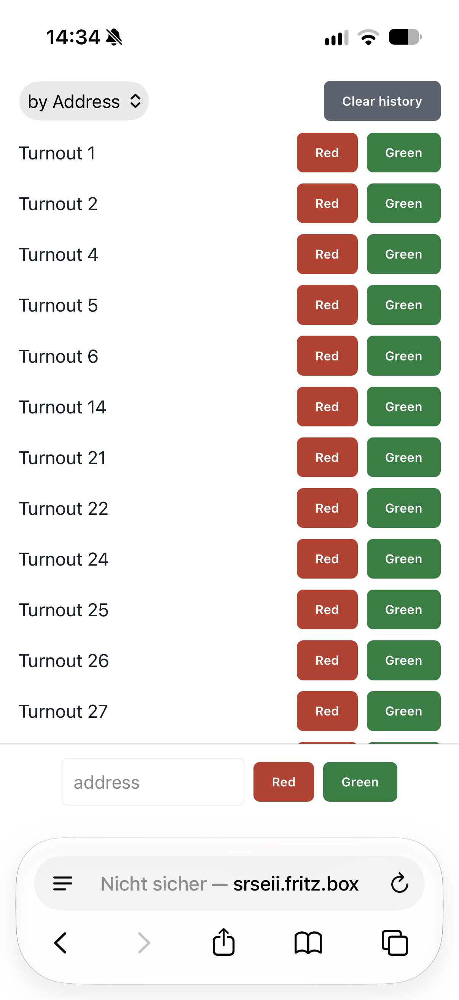

# Weichenweb - Turnout Control Made Easy

A tiny Lua application to control turnouts on your CAN-controlled model railroad layout. No frills, no fuss.

Designed for use with the [SRSEII](http://lnxpps.de/can2udp/srseII/), but works with other webservers as well.

# Usage

<a href="img/webinterface-iphone.png"></a>

Access the webinterface at [http://gleisbox/cgi-bin/weichenweb](http://gleisbox/cgi-bin/weichenweb).

Enter a turnout address in the text box at the bottom and press the "red" or "green" buttons to switch the turnout either way.

Whenever a turnout is controlled, it is added to the list above for repeated use. Simply press the direction button to send another command.
The list holds a history of up to 50 turnouts, stored in FIFO order.
The list is stored locally in the browser.

Display the list sorted by turnout address, or in FIFO order (latest addition at the top).

# Installation

Everything is contained in [main.lua](main.lua). Copy [main.lua](main.lua) to the cgi-bin directory of your webserver, under a convenient name. For a [SRSEII](http://lnxpps.de/can2udp/srseII/), use the following:

```sh
scp main.lua gleisbox:/www/gci-bin/weichenweb
```

Access the webinterface at [http://gleisbox/cgi-bin/weichenweb](http://gleisbox/cgi-bin/weichenweb) (substitute the Hostname of your SRSEII).

If the webserver is running on the same server as the CAN gateway, no further configuration is required. If the CAN gateway is located elsewhere (e.g., when using a CS2, CAN-Schnitte or other gateway), copy `remote-host.txt.example` to the `cgi-bin` directory as `remote-host.txt`:

```sh
scp remote-host.txt.example gleisbox:/www/gci-bin/remote-host.txt
```

Adjust the contained host/port to match the information of your gateway.

## Requirements

* Webserver with support for Lua Scripts running as cgi-bin.
* TCP-based Gateway to the CAN system, e.g. can2lan.

The easiest way to fulfill them is when running on a [SRSEII](http://lnxpps.de/can2udp/srseII/).
Almost as easy is running it in the provided Docker container.

# Development

Everything is contained in [main.lua](main.lua). To try out changes, you can use the provided Docker container. The Container provides an OpenWRT image which does not work well with VS Code, so it won't work as a Devcontainer.

## Docker Container

The container runs the webserver from OpenWRT. Its startup command links the CGI script into uhttpd's document root and starts uhttpd on port 8080.
To build the container, run the following command:

```sh
docker build -t weichenweb:21.02 .
```

Start the container by running the following command from the workspace root. The command will drop you to a shell, but the Webserver is running in the background:

```sh
docker run --rm -it \
  --name weichenweb \
  --publish 8080:8080 \
  --volume "$PWD:/workspace" \
  weichenweb:21.02
```

To access the Webinterface, open [`http://localhost:8080/cgi-bin/weichenweb`]( http://localhost:8080/cgi-bin/weichenweb) in a web browser.

Press `Ctrl-D` or type `exit` to stop the container.

### Modifications

Modifications to the Lua code are picked up automatically, while the container is running.

To use a remote endpoint other than the default `localhost:15731`, copy and
edit the template file before creating or restarting the container:

```sh
cp remote-host.txt.example remote-host.txt
```

If present, `remote-host.txt` must contain exactly one trimmed `host:port` line,
with a TCP port from 1 through 65535. If the file is absent, the default remote
endpoint is `localhost:15731`.

## Configuration

The following environment variables are supported when supplied by the CGI
server: `REMOTE_HOST_FILE` (default `/www/cgi-bin/remote-host.txt`),
`ADDRESS_MIN` (default `1`), `ADDRESS_MAX` (default `1024`), and `CAN_UID` (default `0x00004711`,
decimal or hexadecimal). The reference uhttpd setup uses the default file paths
because uhttpd does not pass arbitrary environment variables to CGI processes.
It provides the standard CGI variables and routes `/api/turnout` as
`PATH_INFO`.

## REST API And Swagger UI

Open the interactive API documentation at
`http://localhost:8080/cgi-bin/weichenweb/swagger`. Swagger UI loads its
OpenAPI document from `/cgi-bin/weichenweb/swagger.json` and provides the
`POST /api/turnout` operation.

The REST endpoint accepts JSON with an integer `address`, `direction` set to
`red` or `green`, and integer `power` set to `0` (off) or `1` (on):

```sh
curl -X POST http://localhost:8080/cgi-bin/weichenweb/api/turnout \
  -H 'Content-Type: application/json' \
  -d '{"address":3,"direction":"red","power":1}'
```

`address` must be from `ADDRESS_MIN` through `ADDRESS_MAX`. A successful
request returns `{"ok":true}`. The Swagger UI page loads the Swagger UI
JavaScript and CSS from `unpkg.com`, so the browser needs internet access for
the interactive styling and controls; the OpenAPI document itself is served
locally.
